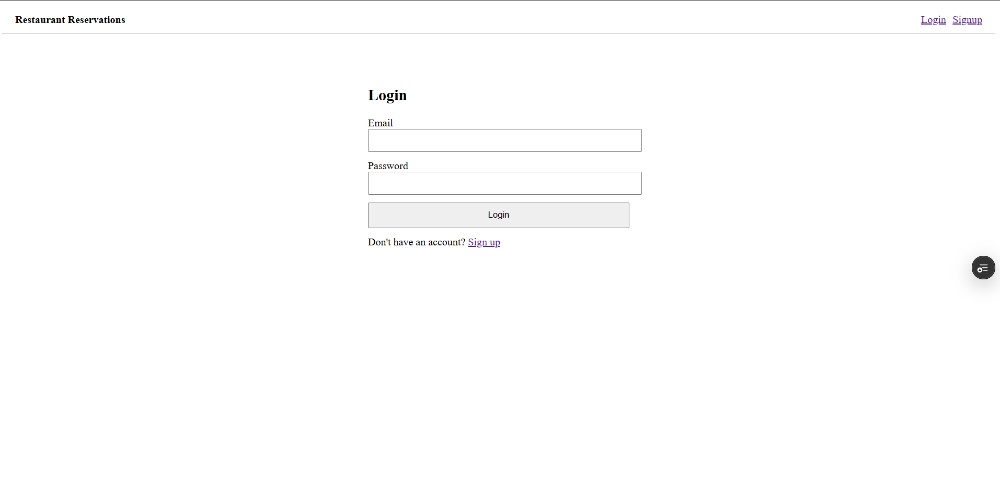
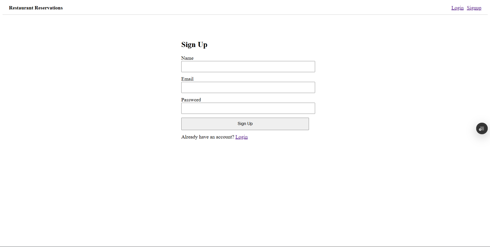

# Restaurant Reservation Management System

A full-stack restaurant table reservation system with role-based access control, built for the Vibecoding Internship assignment (Fission Infotech).

## Live Links
- **Frontend:** https://restaurant-reservation-system-seven-orpin.vercel.app
- **Backend API:** https://restaurant-reservation-api-cfkv.onrender.com/api
- **GitHub Repo:** https://github.com/pradeepkambalapally/restaurant-reservation-system

## Demo Access

**Admin account** (pre-seeded — not available via public signup, by design):

- **Email:** admin@gmail.com
- **Password:** admin123

**Customer account:** Create one via the Signup page, or use any test email/password.

> **Note:** The backend is hosted on Render's free tier, which spins down after inactivity. The first request after idle time may take 30–60 seconds to respond while the server wakes up.

---

## Features

### Customer
- User signup and login using JWT authentication
- Browse available tables
- Create reservations with guest capacity validation
- View personal reservations
- Cancel own reservations

### Admin
- Secure admin login (seeded account only)
- View all reservations
- Filter reservations by date
- Update reservation status
- Cancel any reservation

### System
- Role-based access control
- Reservation conflict prevention
- Capacity validation
- Password hashing using bcrypt
- MongoDB partial unique index for concurrency safety

---

## Tech Stack

### Frontend
- React (Vite)
- React Router
- Axios

### Backend
- Node.js
- Express.js

### Database
- MongoDB (Mongoose)

### Authentication
- JWT (JSON Web Tokens)
- bcrypt

### Deployment
- Vercel (Frontend)
- Render (Backend)
- MongoDB Atlas (Database)

---

## Project Structure

```text
restaurant-reservation-system/
├── backend/
│   ├── config/          # Database connection, constants, seed script
│   ├── controllers/     # Route logic
│   ├── middleware/      # JWT authentication & role guards
│   ├── models/          # User, Table, Reservation schemas
│   ├── routes/          # Express routes
│   └── server.js
│
└── frontend/
    └── src/
        ├── api/         # Axios instance
        ├── components/  # Navbar, ProtectedRoute
        ├── context/     # Authentication context
        └── pages/       # Login, Signup, Customer & Admin dashboards
```

---

## API Endpoints

### Authentication
```
POST /api/auth/signup
POST /api/auth/login
```

### Customer
```
GET    /api/tables
POST   /api/reservations
GET    /api/reservations/my
PATCH  /api/reservations/:id/cancel
```

### Admin
```
GET    /api/admin/reservations
PATCH  /api/admin/reservations/:id
DELETE /api/admin/reservations/:id
```

---

## Environment Variables

### Backend (`backend/.env`)

```env
PORT=3000
MONGO_URI=<your MongoDB Atlas connection string>
JWT_SECRET=<a long random string>

ADMIN_NAME=Admin
ADMIN_EMAIL=admin@restaurant.com
ADMIN_PASSWORD=<choose a password>
```

### Frontend (`frontend/.env`)

```env
VITE_API_URL=http://localhost:3000/api
```

---

## Setup Instructions

### Clone Repository

```bash
git clone https://github.com/pradeepkambalapally/restaurant-reservation-system.git
cd restaurant-reservation-system
```

### Backend

```bash
cd backend
npm install
```

Create a `.env` file using the values shown above.

Seed the database:

```bash
npm run seed
```

Run the backend:

```bash
npm run dev
```

---

### Frontend

```bash
cd frontend
npm install
```

Create `.env`:

```env
VITE_API_URL=http://localhost:3000/api
```

Run the frontend:

```bash
npm run dev
```

---

## Assumptions

- Single restaurant with a fixed set of **8 tables**.
- Tables have seating capacities of **2, 4, 6, and 8**.
- Fixed reservation time slots are used instead of arbitrary start/end times.
- Only one admin account exists and is created through the seed script.
- Cancelled reservations are retained in the database for history while freeing the table for future bookings.

---

## Reservation & Availability Logic

Conflict prevention is enforced at **two layers**.

### 1. Application-Level Validation

Before creating a reservation, the backend checks whether another confirmed reservation already exists for the same:

- Table
- Date
- Time Slot

If a conflict exists, the API returns:

```
409 Conflict
```

---

### 2. Database-Level Protection

MongoDB enforces a **partial unique index** on:

```
{ table, date, timeSlot }
```

filtered by:

```
status = "confirmed"
```

This guarantees that even if two requests arrive simultaneously, duplicate confirmed reservations cannot be created.

Duplicate insert attempts are converted into:

```
409 Conflict
```

responses by the centralized error handler.

---

### Capacity Validation

Before checking availability, the system verifies:

```
guests <= table.capacity
```

If the guest count exceeds the table capacity, the request is rejected with:

```
400 Bad Request
```

---

## Role-Based Access Control

There are two user roles.

### Customer

Customers can:

- Create reservations
- View only their own reservations
- Cancel only their own reservations

Ownership is validated on the server for every request.

---

### Admin

Admins can:

- View all reservations
- Filter reservations by date
- Update reservation status
- Cancel any reservation

---

### Security

The `role` field is **never accepted from the client** during signup.

Every registered user is automatically assigned:

```
customer
```

The only admin account is created through the database seed script.

Protected routes use:

- JWT authentication middleware
- Role authorization middleware

to enforce access control.

---

## Security Features

- Passwords are securely hashed using bcrypt.
- JWT authentication protects private routes.
- Role-based authorization prevents unauthorized access.
- Customers cannot modify other users' reservations.
- Admin accounts cannot be created through public signup.
- MongoDB unique indexes prevent duplicate confirmed reservations.

---

## Known Limitations

- Time slots are duplicated in both frontend and backend.
- No email verification.
- No password reset functionality.
- Table deletion does not check existing reservations.
- JWT is stored in `localStorage` instead of an HTTP-only cookie.
- No pagination for the admin reservation list.
- Backend CORS is fully open for assignment simplicity.
- No rate limiting on authentication endpoints.

---

## Areas for Improvement

Given more development time, the following enhancements would be added:

- Real-time reservation updates using WebSockets.
- Admin UI for adding/editing restaurant tables.
- Shared API endpoint for time slot configuration.
- Unit and integration tests.
- HTTP-only cookie authentication with CSRF protection.
- Restrict CORS to the deployed frontend origin.
- Reservation analytics dashboard.
- Email confirmations and reminders.

---

## Screenshots


### Login


### Signup


### Customer Dashboard


### Admin Dashboard

```
screenshots/
├── login.png
├── signup.png
├── customer-dashboard.png
├── admin-dashboard.png

```

---

## License

This project was developed for the **Vibecoding Internship Assignment (Fission Infotech)** and is intended for educational and evaluation purposes.